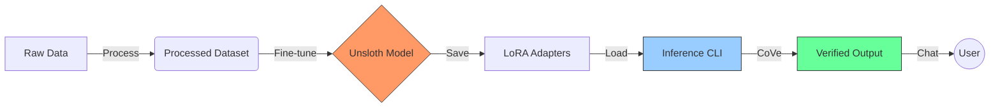

# HexaSLM: Advanced Fine-Tuning & Inference

<div align="center">


[](https://huggingface.co/anekazek/hexaslm-qwen2.5-cybersec-cove)

[](https://opensource.org/licenses/Apache-2.0)
[](https://www.python.org/downloads/)
[](https://github.com/unslothai/unsloth)
[](https://github.com/psf/black)

**HexaSLM** leverages the power of [Unsloth](https://github.com/unslothai/unsloth) to provide blazing fast fine-tuning and inference for Large Language Models (LLMs). It integrates customized data pipelines for cybersecurity and streamlined CLI tools for interaction.

[Get Started](#-quick-start) • [Documentation](#-documentation) • [Features](#-features) • [Contributing](#-contributing)

</div>

---

## 🚀 Features

- **⚡ Blazing Fast**: 2x faster training and 70% less memory usage with Unsloth.
- **🧠 Chain of Verification**: Implements CoVe to reduce hallucinations and verify cybersecurity advice.
- **🛡️ Cybersecurity Focused**: Pre-configured data pipelines for cybersecurity datasets.
- **🖥️ CLI Interface**: Rich, interactive terminal chat for testing your models.
- **📦 Modular**: Valid Python package structure for easy integration.

## 🛠️ Data Flow



## ⚡ Quick Start

### 1. Installation

Clone the repository and install dependencies using `uv` (recommended) or `pip`.

```bash
# Clone
git clone https://github.com/AneKazek/HexaSLM.git
cd HexaSLM

# Install with uv (Recommended)
uv sync

# Or with pip
pip install .
```

### 2. Run Inference

Interact with your model directly from the terminal!

```bash
# Run the chat interface (defaults to the included LoRA adapter)
python -m hexa_slm.inference.console

# Or specify a custom model/adapter
python -m hexa_slm.inference.console --model-path "unsloth/mistral-7b-instruct-v0.2-bnb-4bit"
```

<details>
<summary><b>👀 See CLI Options</b></summary>

```bash
$ python -m hexa_slm.inference.console --help

Usage: python -m hexa_slm.inference.console [OPTIONS]

  Start an interactive chat session with the HexaSLM model.

Options:
  --model-path TEXT       Path to the model or HuggingFace ID [default: models/cove_cybersec_lora]
  --use-4bit / --no-use-4bit
                          Use 4-bit quantization [default: True]
  --system-prompt TEXT    System prompt for the chat [default: You are a cybersecurity expert assistant.]
  --help                  Show this message and exit.
```
</details>

### 🧠 Chain of Verification (CoVe)

HexaSLM implements a systematic **Chain of Verification** process to ensure high-quality, secure responses.

```bash
# Enable CoVe mode in CLI
python -m hexa_slm.inference.console --cove
```

When enabled, the model follows a 4-step reasoning process:
1.  **Initial Analysis**: Breaks down the request.
2.  **Verification Planning**: Identifies critical security checks.
3.  **Systematic Verification**: Validates against OWASP/NIST standards.
4.  **Final Verified Response**: Delivers the safe, verified answer.

## 📚 Documentation

### Training
To train a new model, use the provided notebooks in `notebooks/`.
1. `01-hexaslm-train.ipynb`: Main fine-tuning workflow.
2. `02-hexaslm-inference.ipynb`: Validation and testing.

### Project Structure

```
HexaSLM/
├── data/               # Data storage
│   └── raw/            # Original, immutable data
├── models/             # Model checkpoints (adapters)
├── notebooks/          # Jupyter notebooks
├── src/                # Source code
│   └── hexa_slm/
│       ├── data/       # Data loaders
│       ├── inference/  # Inference scripts (CLI)
│       └── utils/      # Helpers
├── pyproject.toml      # Configuration
└── README.md           # You are here!
```

## 🤝 Contributing

Contributions are welcome! Please feel free to submit a Pull Request.

1. Fork the Project
2. Create your Feature Branch (`git checkout -b feature/AmazingFeature`)
3. Commit your Changes (`git commit -m 'Add some AmazingFeature'`)
4. Push to the Branch (`git push origin feature/AmazingFeature`)
5. Open a Pull Request

## 📄 License

Distributed under the Apache 2.0 License. See `LICENSE` for more information.
